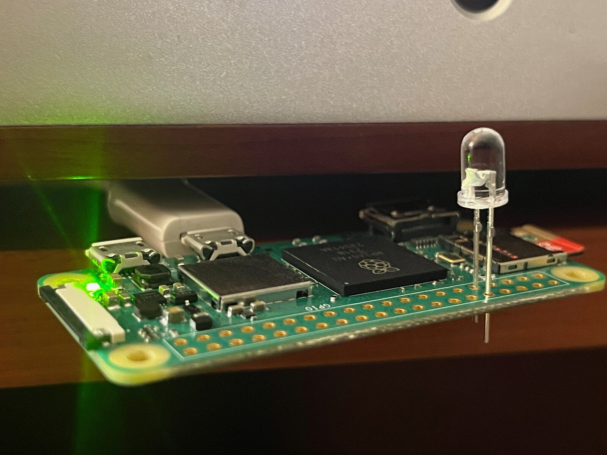
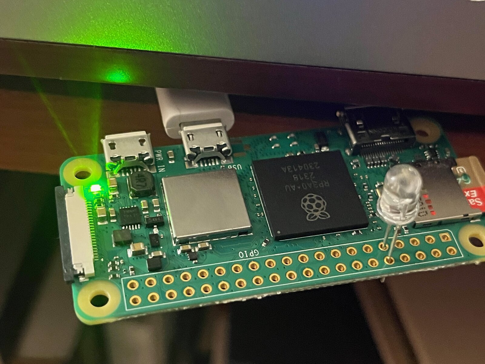

# Peachtree Decco + HiFiBerry + Raspberry Pi IR remote

Turns a Peachtree Audio Decco amplifier on when music starts playing, sets the
volume, switches inputs, and turns it off again when the music stops. One
Raspberry Pi does everything: HiFiBerry DAC, IR LED, and the automation.

Also here: **LIRC config files for the Peachtree Decco and the Peachtree Audio
preDac remotes** — see [IR configs](#ir-configs).

Why it is built this way: **[Automating a 2007 amplifier](https://remco.space/2026/07/15/automating-a-2007-amplifier.html)**.

Works for me. Unmaintained — no support, but issues and better LIRC timings are welcome.

## Prerequisites

- Peachtree Decco amplifier
- Raspberry Pi (a Pi 3 here) running Raspberry Pi OS — **not** HiFiBerryOS
- HiFiBerry DAC HAT, connected to one of the Decco's analogue inputs
- An IR LED. No transistor or resistor needed: the LED sits inside the case,
  a few centimetres from the Decco's own IR receiver, pointed straight at it.
- An audio source. Here that is [shairport-sync](https://github.com/mikebrady/shairport-sync)
  (AirPlay) in Docker — `mikebrady/shairport-sync:development`, `network_mode: host`,
  `/dev/snd` passed through. Anything that plays to the HiFiBerry works: the
  automation only watches ALSA, not the source.
- Optional: Home Assistant, to toggle the amp by hand.

## Wiring

| | |
|---|---|
| GPIO 18 | IR receive |
| GPIO 15 | IR transmit |

IR LED: long leg into pin 15, short leg into ground. No soldering needed for a
prototype. A visible-light LED in the same holes is useful for debugging — you
can see the codes go out.




## Install

**1. LIRC and the GPIO overlays.**

```bash
sudo apt install lirc
```

Add to `/boot/firmware/config.txt`:

```
dtoverlay=gpio-ir,gpio_pin=18
dtoverlay=gpio-ir-tx,gpio_pin=15
```

> Older guides tell you to add `lirc_dev` / `lirc_rpi` to `/etc/modules`. That is
> obsolete — the dtoverlays above are the whole story. Adding it does nothing.

In `/etc/lirc/lirc_options.conf`:

```
driver = default
```

Reboot for the overlays to take.

**2. IR configs.**

```bash
sudo cp decco.lircd.conf /etc/lirc/lircd.conf.d/
sudo systemctl restart lircd
```

Test — this should switch the amp to AUX1:

```bash
irsend SEND_ONCE decco AUX1
```

If that errors with input/output, the GPIO or LIRC setup is wrong. If it succeeds
but nothing happens, check the LED is the right way round and actually aimed at
the receiver.

**3. The automation.**

```bash
sudo cp decco-pi-led-hifiberry.py /usr/local/bin/
sudo chmod +x /usr/local/bin/decco-pi-led-hifiberry.py
sudo cp decco-pi-led-hifiberry.service /etc/systemd/system/

sudo python3 -m venv /opt/decco-venv
sudo /opt/decco-venv/bin/pip install -r requirements.txt
```

**4. Home Assistant toggle (optional).**

Skip this and the playback automation still works on its own.

```bash
sudo mkdir -p /etc/decco
sudo cp ha-listener.env.example /etc/decco/ha-listener.env
sudo chmod 600 /etc/decco/ha-listener.env
sudo $EDITOR /etc/decco/ha-listener.env
```

Fill in `HA_WS_URL`, `HA_TOKEN` and `EVENT_ENTITY`. The script has no defaults for
these — the token is a secret and the other two are specific to your setup. Point
`HA_WS_URL` at a hostname your HA certificate matches so TLS verification stays on.

**5. Start it.**

```bash
sudo systemctl daemon-reload
sudo systemctl enable --now decco-pi-led-hifiberry
sudo systemctl status decco-pi-led-hifiberry
journalctl -u decco-pi-led-hifiberry -f
```

## Configuration

Edit the constants at the top of `decco-pi-led-hifiberry.py`:

| | |
|---|---|
| `HIFIBERRY_SOUND_CHANNEL` | which Decco input the HiFiBerry is plugged into |
| `HIFIBERRY_DEFAULT_VOLUME` | volume, counted in IR `VOL_UP` ticks from zero |
| `CHECK_INTERVAL` | how often to poll ALSA, seconds |
| `NO_SOUND_THRESHOLD` | silence before switching off, seconds |

## IR configs

Two LIRC remote configs, both recorded from the original handsets with `irrecord`:

| file | remote | protocol | notes |
|---|---|---|---|
| `decco.lircd.conf` | Peachtree Audio Decco | 32-bit `SPACE_ENC` | has a `repeat` header, so holding volume drives the motor smoothly instead of stuttering |
| `predac.lircd.conf` | Peachtree Audio preDac | RC5, 13-bit | a different amplifier; as far as I can tell, the only preDac config published anywhere |

Drop either into `/etc/lirc/lircd.conf.d/` and restart `lircd`. The remote names
are `decco` and `Predac` respectively:

```bash
irsend LIST decco ""
irsend SEND_ONCE Predac ONOFF
```

## Housekeeping

Two cron entries on this Pi — neither is required, both are here for reference:

```cron
# pull a fresh shairport-sync image weekly
15 3 * * 0 cd /opt/shairport-sync && docker pull mikebrady/shairport-sync:development && docker compose up -d
# reboot nightly
5 4 * * * /sbin/shutdown -r
```

## License

MIT — see [LICENSE](LICENSE).
